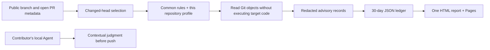

# Architecture and operational boundaries

## Components

The implementation uses Python 3.11+ standard-library code, Git object reads, the GitHub REST API, GitHub Actions and GitHub Pages. No database, always-on server, model API or cross-repository write credential is required.

## Inventory and routing

The organization scope is defined once in `general_auditor/config.py`. Discovery includes all currently public repositories, including archived repositories and public forks. Default branches are discovered, never assumed to be `main`. Each current branch and open PR is observed; only a changed or new head is scheduled during automatic runs. A manual run selects exactly one repository or explicitly selects the entire inventory.

Reading another repository's metadata is not an audit. A change to repository A does not schedule an unchanged repository B. Simultaneous independent changes can be processed in the same scheduled job. Candidate deduplication is scoped by repository, head and base. Up to four scans run concurrently using one Git blob-reader process per scan.

New repositories receive a central profile from the initialization defaults. Existing profiles are validated and preserved. No target repository is required to have a particular directory, policy file, workflow or branch. Repository-supplied configuration is not silently trusted by central CI.

Website, documentation, benchmark and organization-profile categories additionally select read-only GitHub access-policy observation. Settings are read once per selected repository and included in its report. Hidden bypass identities are reported as unverified; the separate administrator operation verifies the complete configuration. See [access-policy administration](access-policy.md).

## Git coverage

An initial branch audit reads that branch's current committed tree. It does not scan all prior history. Subsequent audits read changed file versions in every newly observed reachable commit. A PR starts from its base, resolving a common ancestor if the base advanced. Merge resolutions are included through first-parent diffs; introduced side-branch commits are also traversed. Duplicate path/blob pairs are read once per scan.

After divergent history, a common ancestor is used when available. Unrelated histories receive a snapshot audit, labeled accordingly. Local range scans reject shallow history rather than asserting complete range coverage. Deleted or inaccessible objects can produce an incomplete scan; a failed head is not acknowledged and is eligible for the next discovery run.

The scanner inspects UTF-8 Git blobs up to 2 MiB. Larger files, binary/non-UTF-8 files, symbolic-link targets, submodules and LFS payloads are listed as coverage exclusions. It does not inspect PR titles, descriptions, comments, commit messages, issue content, unstaged changes, untracked files or external runtime data. These remain part of contributor-side contextual review. Regex detectors are intentionally incomplete signals, not general secret-recognition or privacy proofs.

Public Git snapshots are fetched into isolated temporary bare repositories. No target build, dependency installer, hook, submodule initialization, action, script, template or Agent instruction is executed. Scanner Git processes do not inherit Git configuration or API credentials. Target source values and process stderr are withheld from results and logs.

## Reports and retention

- `reports/index.html`: the single fixed HTML report, replaced after each completed central run.
- `reports/data.json`: retained redacted runs, deduplicated by run identity, pruned at the UTC 30-day boundary.
- `reports/state.json`: last successfully inspected head for each currently observed branch/PR; failures are not acknowledged.
- `reports/inventory.json`: current public scope, default branches and archive status.

The report includes each finding individually: location, rule, withheld-value category, `unreviewed` judgment and basis, potential impact and handling recommendation. It also lists explicit exclusions, infrastructure failures and repository-specific Agent review requirements. Source snippets are never copied. Suspected sensitive path components are masked; such locations do not become source links.

Current visibility is rechecked on every central run. Results for repositories no longer public are removed from the current ledger and HTML. The public publisher rejects records marked private. Local scans default to private and are not uploaded to the central report.

The current HTML and ledger contain only the rolling window. **Git history, workflow logs, downloaded copies and external caches are not retroactively erased.** Reports are redacted before first publication. The Pages artifact contains only the HTML document and has one-day retention. Source artifacts and Git object history are not deleted by report pruning.

## Workflow behavior

`audit.yml` runs manually or on a 15-minute schedule. One concurrency group serializes report writers; queued runs check out the latest `main` so they see published observations. The default pending-run replacement behavior is disabled with `queue: max`. A source change to General-Auditor runs its verification workflow and does not fan out an audit of all target repositories. Policy changes apply at the next target scan; maintainers can explicitly request a full inventory audit when needed.

Infrastructure failures are persisted and the HTML is deployed before the workflow reports failure. Pattern warnings never fail the job. If inventory retrieval fails entirely, the workflow fails and does not claim that a fresh scan occurred. Ordinary scans use the workflow's built-in `GITHUB_TOKEN` to read public metadata and write this repository's redacted report. Audit and Pages deployment share one runner allocation. The job has the contents, Pages and identity-token permissions needed to publish this repository; audited code is never executed.

Scheduled Actions can be delayed or dropped under platform load, and public repositories with no activity can have schedules disabled by GitHub. Branches or PRs created and removed entirely between observations may not be seen. Queue capacity, platform execution limits, API availability and repository access also apply. This design does not promise a local hook, pre-publication filtering or delivery of every transient event. Optional repository-local workflows provide immediate advisory feedback but cannot guarantee contributor compliance.

## Private repositories

Private repositories can use the local CLI or optional CI action, selecting the common fallback and an explicit local profile when needed. The three-organization public collector deliberately excludes them. Private results must remain in private local or CI storage; a separate private General-Auditor deployment would need an explicitly scoped authenticated reader and private report hosting. The public Pages workflow is not a private-report solution.

## Platform references

- [GitHub workflow events and schedule limitations](https://docs.github.com/en/actions/reference/workflows-and-actions/events-that-trigger-workflows)
- [GitHub workflow concurrency and queued runs](https://docs.github.com/en/actions/how-tos/write-workflows/choose-when-workflows-run/control-workflow-concurrency)
- [GitHub REST repository API](https://docs.github.com/en/rest/repos/repos)
