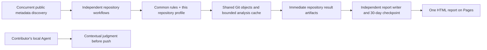

# Architecture and operational boundaries

## Components

The implementation uses Python 3.11+ standard-library code, Git object reads, the GitHub REST API, GitHub Actions and GitHub Pages. No database, always-on server, model API or cross-repository write credential is required.

## Inventory and routing

The organization scope is defined once in `general_auditor/config.py`. Discovery includes all currently public repositories, including archived repositories and public forks. Default branches are discovered, never assumed to be `main`. Each current branch and open PR is observed; only a changed or new head is scheduled during automatic runs. A manual run selects exactly one repository or explicitly selects the entire inventory.

Reading another repository's metadata is not an audit. A change to repository A does not schedule an unchanged repository B. Discovery processes up to eight repositories concurrently and dispatches each ready repository without waiting for slower metadata calls. Each dispatched repository has an independent GitHub workflow and concurrency group; the platform's runner quota limits how many execute simultaneously. The local batch command also processes up to eight repositories concurrently and persists each completed repository immediately.

Candidate deduplication is scoped by repository, head and base. A repository fetches all selected immutable refs into one bare object store. Its branch scans reuse one blob reader and a standard-library LRU cache of up to 4,096 path/blob analyses. Cache entries contain signal metadata, not source values; each scan retains its own commit locations. The cache is released at repository completion. Report rendering groups runs once by repository rather than repeatedly searching the entire ledger.

New repositories receive a workspace profile from the initialization defaults. Existing central profiles are validated and preserved. Maintainers persist refinements through a PR; workers never push generated profiles into the source branch. No target repository is required to have a particular directory, policy file, workflow or branch. Repository-supplied configuration is not silently trusted by central CI.

Website, documentation, benchmark and organization-profile categories additionally select read-only GitHub access-policy observation. Settings are read once per selected repository and included in its report. Hidden bypass identities are reported as unverified; the separate administrator operation verifies the complete configuration. See [access-policy administration](access-policy.md).

## Git coverage

An initial branch audit reads that branch's current committed tree. It does not scan all prior history. Subsequent audits read changed file versions in every newly observed reachable commit. A PR starts from its base, resolving a common ancestor if the base advanced. Merge resolutions are included through first-parent diffs; introduced side-branch commits are also traversed. Duplicate path/blob pairs are read once per scan.

After divergent history, a common ancestor is used when available. Unrelated histories receive a snapshot audit, labeled accordingly. Local range scans reject shallow history rather than asserting complete range coverage. Deleted or inaccessible objects can produce an incomplete scan; a failed head is not acknowledged and is eligible for the next discovery run.

The committed-tree scanner inspects UTF-8 Git blobs without a fixed text-size cutoff. Binary/non-UTF-8 files, symbolic-link targets, submodules and LFS payloads remain explicit uninspected coverage. A repository-specific source-size policy can reject an oversized file independently of privacy scanning. Central CI does not inspect PR titles, descriptions, comments, commit messages, issue content, unstaged changes, untracked files or external runtime data. The local CLI has explicit `staged` and `worktree` scopes for outgoing local files and `history` for all commits reachable from a selected head. These are separate local operations, not promises that GitHub triggers a workflow on the contributor's machine. Regex and syntax-aware detectors remain incomplete advisory signals, not general secret-recognition or privacy proofs.

## Local contextual review

The local CLI can create a redacted request from a scan, including its exact scan identity, selected commit scope, findings, semantic tasks and a repository-relative file manifest when local scope is available. `review-request --template` renders a handoff envelope whose `receipt_template` object is completed and saved separately; `review-complete` validates one receipt against the same scan and writes a local-only report. The receipt keeps every finding judgment tied to its scan and cannot create persistent detector exceptions. Staged and worktree-only findings have no commit SHA and are explicitly bound using a null commit plus the scan's scope.

The receipt records the reviewer-provided content only. It does not identify the author, prove that an Agent ran, establish that every privacy duty was performed, or certify the repository as safe. Common raw-source fields and recognized secret/path patterns are rejected, but redaction remains the contributor's responsibility. Requests, receipts and reviewed reports stay local and are not ingested by the shared report publisher.

Public Git snapshots are fetched into isolated temporary bare repositories. No target build, dependency installer, hook, submodule initialization, action, script, template or Agent instruction is executed. Scanner Git processes do not inherit Git configuration or API credentials. Target source values and process stderr are withheld from results and logs.

## Reports, persistence and retention

These paths are generated workspace files, stored in the `audit-checkpoint` Actions artifact rather than committed to source:

- `reports/index.html`: the single HTML report, deployed at the fixed Pages URL.
- `reports/data.json`: retained redacted runs, deduplicated by run identity and pruned at the UTC 30-day boundary.
- `reports/state.json`: successful branch/PR observations, per-repository observation times and consumed artifact identities. Failed heads are not acknowledged.
- `reports/inventory.json`: current public scope, default branches and archive status.

Each worker uploads `audit-result-<owner>--<repository>` as soon as that repository finishes. The packet contains only that repository's redacted 30-day ledger and observations. The worker restores its latest packet as well as the central checkpoint, so a delayed publisher does not force repeated scanning. A failed scanner saves its failure evidence before failing the workflow.

The publisher restores the latest checkpoint and coalesces completed repository packets. It records consumed workflow-run identities so queued notifications for already merged runs can skip repeated archive discovery. Scheduled and manual reconciliation recovers durable packets whose completion notification was missed. It merges run identities and updates observations only from a newer per-repository observation time. Result identity and public scope are checked before ingestion. Artifact restoration admits only executions from this repository's protected `only` branch; PR and fork artifacts are excluded. Archives are read by exact JSON member name and never extracted or executed.

One publication concurrency group serializes the shared state update. Scanners do not wait for that group or for Pages. The complete checkpoint is uploaded before deployment, preserving successful scans if Pages fails. Duplicate completion events skip a deployment when they have no new results, expired records or inventory changes. Scheduled and manual publication refreshes also reconcile missed results. One bad repository is represented as an incomplete scan; it does not stop other repository workflows.

The report includes each finding individually: location, rule, withheld-value category, `unreviewed` judgment and basis, potential impact and handling recommendation. It also lists explicit exclusions, infrastructure failures and repository-specific Agent review requirements. Source snippets are never copied. Suspected sensitive path components are masked; such locations do not become source links.

Current visibility is rechecked on every discovery and publication run. An inventory change immediately requests publication without scanning removed repositories. The publisher removes results for repositories no longer public from the current ledger and HTML and rejects records marked private. Local scans default to private and are not uploaded to the central report.

The current HTML and ledger contain only the rolling window. Every publication prunes expired runs; a daily publication handles idle periods. Checkpoint and repository-result artifacts expire 30 days after creation, while the Pages upload artifact expires after one day. Prior artifact snapshots, Git history, workflow logs, downloaded copies and external caches are not retroactively rewritten when the current ledger is pruned. Reports are redacted before first publication. If all retained checkpoints and repository packets have expired after extended inactivity, collection starts new snapshot coverage instead of claiming an unavailable historical range.

## Workflow behavior

| Workflow | Trigger | Responsibility |
| --- | --- | --- |
| `audit.yml` | Every 15 minutes or explicit dispatch | Discover changed repositories and dispatch independent workers. Manual runs can force a selected repository or all public repositories. |
| `audit-repository.yml` | Dispatcher or explicit maintainer dispatch | Restore observations, inspect one repository, upload its result, then finish independently. |
| `publish-report.yml` | Each worker completion, report implementation changes, daily schedule or explicit dispatch | Reconcile durable results, expire records, upload the checkpoint and deploy one HTML document. |

All execute trusted code from `only`. `queue: max` preserves pending runs; only repeated scans of the same repository share a scan queue. Source changes run verification and do not trigger a full inventory audit. The dispatcher has Actions write permission to dispatch workers. Scanners have read-only source and Actions access. The publisher has read-only source/Actions access plus Pages and identity-token permissions. None has source-write permission or a Ruleset bypass. No private cross-repository credential or paid Agent token is supplied.

Privacy and keyword warnings never fail scanning. A declared structural repository-contract violation produces `policy_failure`; unreadable required input or an execution failure produces `incomplete`. Neither status is a privacy judgment. A worker that fails before producing an artifact can produce a workflow-failure report entry; its unacknowledged heads remain eligible for discovery. If discovery or artifact access fails entirely, that workflow fails without claiming a fresh scan. Required source checks and PR protection are separate from audit warnings.

Scheduled Actions can be delayed or dropped under platform load, and public repositories with no activity can have schedules disabled by GitHub. Branches or PRs created and removed entirely between observations may not be seen. Queue capacity, platform execution limits, API availability and repository access also apply. This design does not promise a local hook, pre-publication filtering or delivery of every transient event. Optional repository-local workflows provide immediate advisory feedback but cannot guarantee contributor compliance.

## Private repositories

Private repositories can use the local CLI or optional CI action, selecting the common fallback and an explicit local profile when needed. The three-organization public collector deliberately excludes them. Private results must remain in private local or CI storage; a separate private General-Auditor deployment would need an explicitly scoped authenticated reader and private report hosting. The public Pages workflow is not a private-report solution.

## Platform references

- [GitHub workflow events and schedule limitations](https://docs.github.com/en/actions/reference/workflows-and-actions/events-that-trigger-workflows)
- [GitHub workflow concurrency and queued runs](https://docs.github.com/en/actions/how-tos/write-workflows/choose-when-workflows-run/control-workflow-concurrency)
- [GitHub REST repository API](https://docs.github.com/en/rest/repos/repos)
